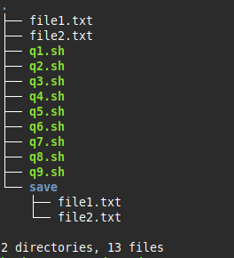

# InteractWithYourLaptop
Diverse shell scripts to run c programs, install packages and applications and manage files using commands such as find/echo/cp... 
## Ex2
### Q1
Write a simple script that will check if exactly two arguments are passed. If so, display the arguments in reverse order.
### Q2
Write a short script that accepts an argument. If an argument is passed, check if this argument matches the name of the current directory. If so, display yes. Otherwise, display no.
### Q3
Write a script that will make backup copies of all files ending in .txt in a subdirectory defined in the first argument.

### Q4
Write a script that grants execution rights to the owner for all scripts ending in .sh in a directory defined in the first argument.
### Q5
Write a script that allows installing an application defined in the first argument.
### Q6
Write a script that allows installing two applications defined in the arguments.
### Q7
Write a script that allows uninstalling an application defined in the first argument.
### Q8
Write a script that saves to a file the lines entered from the keyboard, and displays the number of lines that were saved.
### Q9
Write a script that compiles and executes a C file defined in the first argument.
